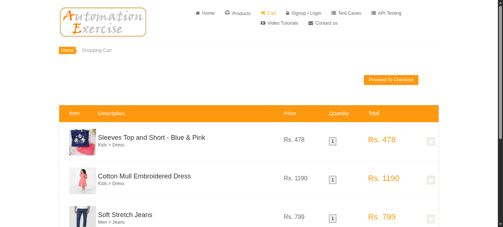
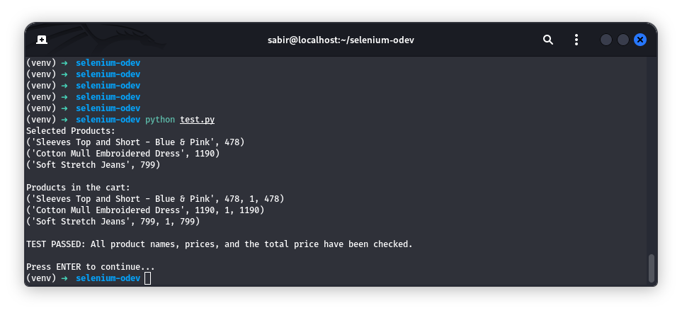

# AutomationExercise – Product and Price Verification Test

This project implements an automated UI test using Selenium WebDriver to verify product and price consistency on the AutomationExercise website.


## 📌 Project Type
Automation Testing / Selenium / UI Validation

## 📌 Objective

The goal of this project is to ensure that product information (name, price, and total cost) remains consistent between the products page and the shopping cart.

## 🛠 Technologies Used

- Python
- Selenium WebDriver
- Chromium Browser
- Kali Linux

## 🚀 Test Scenario

The automated test performs the following steps:

1. Navigate to the products page  
2. Retrieve all available products  
3. Randomly select multiple products  
4. Extract product names and prices  
5. Add selected products to the cart  
6. Navigate to the cart page  
7. Extract cart data  
8. Validate:
   - Product names  
   - Product prices  
   - Quantities  
   - Total prices  
   - Overall cart total  

## ✅ Validation

Assertions are used to verify:

- Matching product names  
- Correct product prices  
- Correct quantity values  
- Accurate total calculations  

## 📸 Screenshots

| Description | Preview |
|------------|--------|
| Products Page | <a href="figure1_products_page.png"></a> |
| Adding Products | <a href="figure2_selected_products_added.png"></a> |
| Cart Page | <a href="figure3_cart_page.png"></a> |
| Test Result | <a href="figure4_test_passed.png"></a> |

## ▶️ How to Run

```bash
# Create virtual environment
python3 -m venv venv
source venv/bin/activate

# Install dependencies
pip install selenium

# Run test
python test.py

## 👨‍💻 Author

Sabir Suleymanli  
Computer Engineering Master's Degree Student  
GitHub: https://github.com/sabir-suleyman
